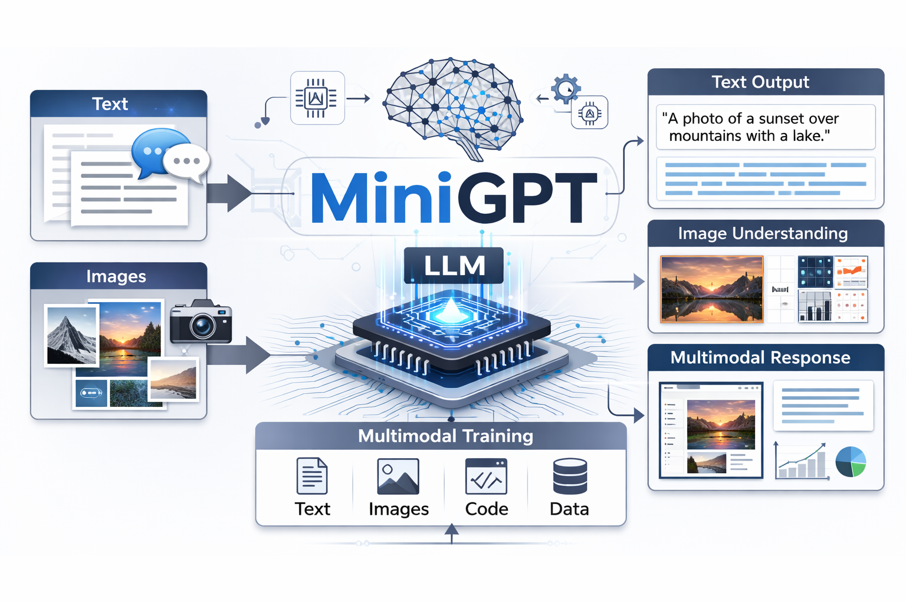

## Transformer Capstone (MiniGPT)

MiniGPT is a small scale decoder only transformer language model built from scratch.  
The goal is to understand how GPT style models work at an architectural and training level, not to achieve large scale performance.

This project is a senior capstone focused on implementing the full language model pipeline, including tokenization, attention, training, and text generation.

## Project objectives

I implement a GPT style transformer end to end.  
I train the model using next token prediction.  
I analyze how model size, context length, and training settings affect output quality.  
I produce a working model that can generate text from a prompt.

## Core features

- Byte Pair Encoding tokenizer trained on the dataset  
- Decoder only transformer architecture  
- Masked self attention  
- Feed forward transformer blocks  
- Autoregressive text generation  
- Training loss and perplexity tracking  

## End Goals

- Match the benchmarks of the model used in the "Attention is All You Need" paper published in 2017

## Contact Info:
email: swhall2008@gmail.com
cell: +1(732)500-5396